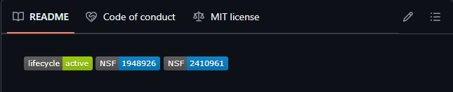
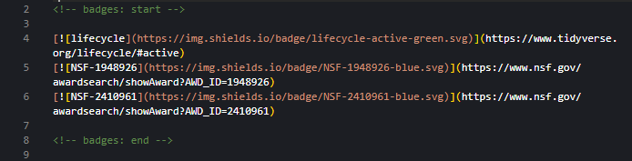

# Neotoma GitHub Repo Best Practices
A repo that describes the recommended practices for setting up new repositories within the Neotoma Paleoecology Database.

## Initial Set up

### Repo Name
Choose a short and identifiable name for your repo.

### Description
Add a short description of the purpose of the repo; additional description will be put in the README.

### Public vs Private
Most repos will be public or made public upon the publication of the resource.

### README
This box should be checked upon repo set up. All repos should have a descriptive README document (see below).

### Gitignore
Check this if necessary for your specific project.

### License
All repos should have an appropriate license. The MIT license is a good default for NeotomaDB repos.

## README
### General advice
Your repositories README should provide a brief yet informative description of the repository's goal or mission (what it does, why it matters etc.) This should allow new users or collaborators to understand the context of the project without having to sift through excessive or irrelevant information. 
### Badges
Badges provide at-a-glance information about a project's status, funding, and more. They improve the readbility of your repository by quickly communicating key project metadata. Including badges helps show that a project is actively maintained, clearly supported, and easy to trust

***-Lifecycle Badges*** 

Lifecycle badges indicate the current development status of the project (e.g.,Active, Experimental, Deprecated).
Learn more about [lifecycle stages here](https://lifecycle.r-lib.org/articles/stages.html)

***-NSF Grant Badges***

These badges recognize the support of specific NSF grants and link to their award details

**Badge Display + Markdown Code**

## Other Recommended Practices
### Code of Conduct
Include a Contributor Code of Conduct to help ensure a respectful, inclusive, and harassment-free environment for all contributors. This sets a clear tone for collaboration. Most open-source projects adopt a standard Code of Conduct, which outlines necessary expectations for behavior and procedures regarding the reports of misconduct.
### Website
### Topics
### Releases
### Citations